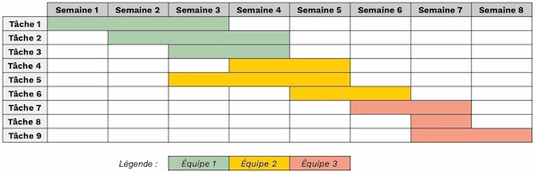

# Chronor

## Test Lead dev - Keyros

Le but de cet exercise est de réaliser sous ReactJS le front-end d'une application de gestion d'équipe à destination d'un manager pour s'assurer d'une répartition cohérente du temps de chacun.

Vous êtes libre d'ajouter toute dépendances Javascript ou CSS que vous jugerez utile pour l'exercice.

Pour simuler les interractions avec le back-end, 2 services "mock" ont été fournis. La gestion des exceptions, n'étant pas implémentée, il n'est pas demandé à ce stade d'y prêter une attention particulière.

### UserService
Expose:

* list() -> return an array of all *Users*

### TaskService
Expose CRUD endpoints to manipulate *Tasks*:

* list() -> return an array of all *Tasks*
* get(id) -> return the the *Task* with *id*
* put(id, Task) -> update the field of the task with *id*, with the values of *Task* and return the updated *Task*
* post(Task) -> create a new *Task* and return it
* delete(id) -> destroy the *Task* with *id* and return it

## Specifications

Le but est de l'exercice d'implémenter successivement les "User Stories" suivantes:

* #1 As a Manager I want to see a list of all the tasks registered
* #2 As a Manager I want to be able to filter the tasks for a specific user and be able to switch back to the unfiltered list
* #3 As a Manager I want to be able to create a new task for a given User
* #4 As a Manager I want to be able to change a task (change User, Start or End date)
* #5 As a Manager I want to be able to remove a task
* #6 As a Manager I want to be able to get a visual hint (mark in red for instance) if some Tasks present conflicts. A conflict means for a same User, there is an overlap between 2 tasks period.
* #7 As a Manager I want to have a visual representation of the affectations of Users. It should take the form of a simple gantt diagram (indicative example)

* #8 (BONUS) As a Manager I want to be able to edit the start or the end date of a task by dragging the extremities of its segment on the gantt diagram 

## Temps estimé (hors bonus)
<3h